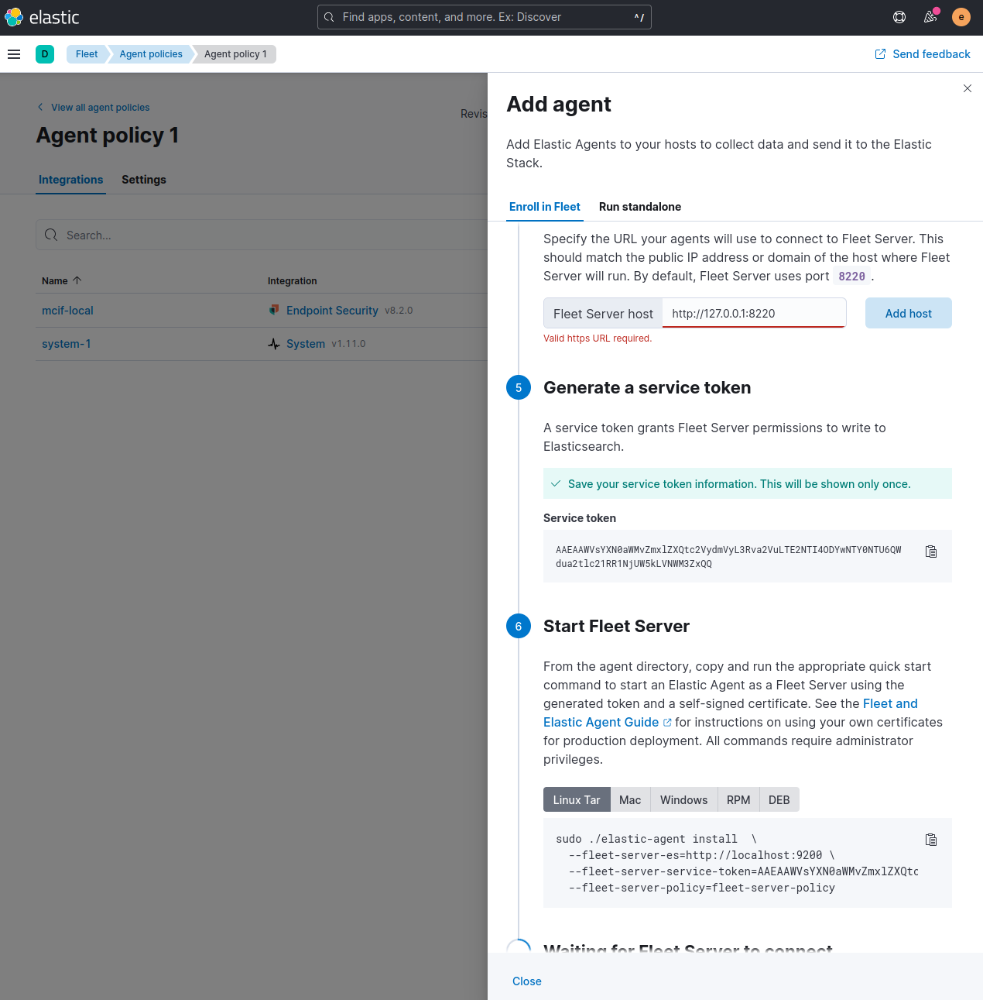

# ELK stack running on Docker

The goal of this project is to have an easy way to have the ELK stack running to explore it.


## setup

Edit the .env file and set a password for

```
ELASTIC_PASSWORD=<your-secure-elastic-password>
KIBANA_PASSWORD=<your-secure-kibana-password>
```

This setup has been tested for STACK_VERSION=8.2.0 but might work for future releases, just need to follow the guides for future versions.

This has been inspired from this guide:

- https://www.elastic.co/guide/en/elastic-stack-get-started/current/get-started-stack-docker.html#run-docker-secure


## How to run

From within this directory root, run the following command to pull the required images and start up the ELK stack.

```
docker-compose up
```


http://localhost:5601


## setup agent


# download agent from here

https://www.elastic.co/downloads/past-releases/elastic-agent-8-2-0


Extract the agent (Linux manjaro)

tar -xvzf elastic-agent-8.2.0-linux-arm64.tar.gz 


NOTE: This command can be copied from the wizard "add agent"





sudo ./elastic-agent install  \
  --fleet-server-es=http://localhost:9200 \
  --fleet-server-service-token=AAEAAWVsYXN0aWMvZmxlZXQtc2VydmVyL3Rva2VuLTE2NTI4ODYwNTY0NTU6QWdua2tlc21RR1NjUW5kLVNWM3ZxQQ \
  --fleet-server-policy=fleet-server-policy


  ## Troubleshoot

  sysctl vm.max_map_count


Run this to set max_map_count

  sudo sysctl -w vm.max_map_count=262144


Agent needs to be able to comunicate with elasticsearch.

Copy the generated cert from docker:

docker cp elk-stack-docker-es01-1:/usr/share/elasticsearch/config/certs/ca.zip .

Extract ca.zip and you should see `ca.crt` and `ca.key`

Trust the ca.crt file, in linux manjaro you cna do the following steps:


```
sudo trust anchor --store ca/ca.crt
sudo update-ca-trust
```

after this restart your agent:

```
systemctl restart elastic-agent
```


cd /opt
curl -L -O https://artifacts.elastic.co/downloads/beats/elastic-agent/elastic-agent-8.2.3-linux-x86_64.tar.gz
tar xzvf elastic-agent-8.2.3-linux-x86_64.tar.gz
cd elastic-agent-8.2.3-linux-x86_64

./elastic-agent install

# start agent after configuration

./elastic-agent -c elastic-agent.yml -e


# access wordpress
docker exec -it myproject-wordpress-1 /bin/bash


apt update
apt install vim

vim elastic-agent.yaml
# copy config from "add endpoint" wizard in Kibana.


https://www.elastic.co/guide/en/fleet/current/start-stop-elastic-agent.html

service elastic-agent status
service elastic-agent start
service elastic-agent stop


# test
https://www.michael-wutzke.com/curl-and-elasticsearch/
curl -u elastic:CHANGEME https://es01:9200 -k
curl -u elastic:CHANGEME https://es01:9200 --cacert /usr/share/elasticsearch/certs/ca/ca.crt
curl -u elastic:CHANGEME https://es01:9200


# @todo add elk certificate as trusted


# wordpress site
user: gars
pass: gars123!
http://localhost:8000/


# on wordpress machine
cp /usr/share/elasticsearch/config/certs/ca/ca.crt /usr/local/share/ca-certificates/
update-ca-certificates


